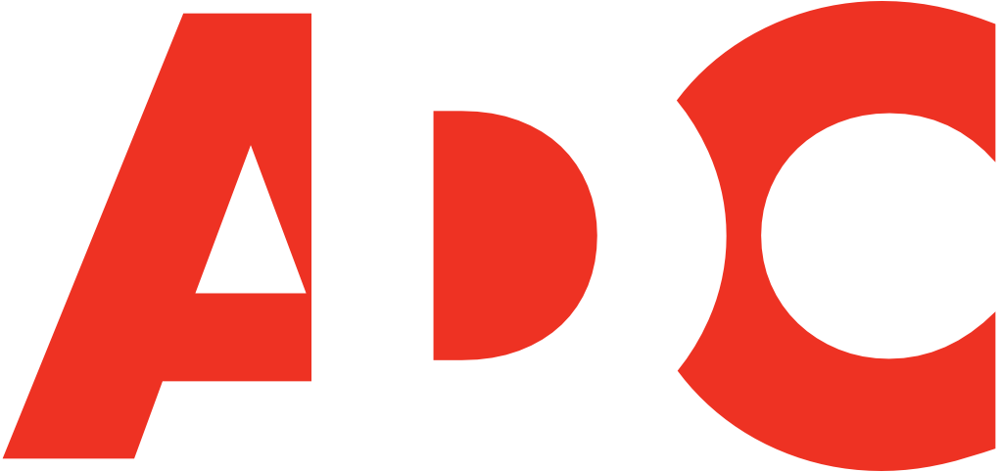

# Status Update for Week 1

## Last Week's Accomplishments
* Created mockups with Adobe XD so that Android developers on the team can reproduce the designs for their Android version.
    * [Link to Mockup](https://xd.adobe.com/view/17da77c7-dec0-4c34-64b8-86dfc6d39df9-61eb/screen/e8d96970-3e49-4a95-be49-390370ba8810/)
* Designed the logos for ADC and incorporated them into the app as well as all related media platforms.

* Created an option within the iOS app to contact RPI Fixx by sending an email.

## This Week's Plan
* Start implementing accessibility features such as VoiceOver since the user group for this app consists of disabled students.
* Fix a bug where the app may freeze.

## Anything Blocking
N/A

## Notes
N/A
